**Course: CST1510 -CW2 - Multi-Domain Intelligence Platform**

Student Name: Marina Doolub Julie Marie
Student ID: M01085595

## Project Description
A multi_domain command-line platform built in Python & SQL, combining secure authentication system,implementing secure password hashing,role-based access control and full CRUD operations,with a web-based Streamlit dashboard for interactive analytics.This system allows users to register accounts and log in with proper pass and demonstrates strong security practices such as encrypted password storage, password strength ,login attempts being monitored, account lockout protection and lastly a secure token generation for aunthenticated sesssions. Additionally, the platform incorperates AI-powered analytics, providing insights, trends and recommendations across domains.

## Features

1.Authentication & security;

- Secure password hashing using bcrypt with automatic salt generation.
- User registration with duplicate username prevention.
- User login with password verification.
- Password strength checkeing enforcing complexity rules.
- Session token creation for authenticated users.
- Role based access control.
- Account lockout system after multiple failed attempts.
- Input validation for usernames and passwords.

2.Database & Multi-Domain Operations;

- Users table with full CRUD operations.
- Cyber Incidents, Dataset Metaset and IT Tickets table with CRUD operations.
- File-based user data persistence.

3.AI-Powered Assistant and insights;

- Interactive dahsboard with analytics, viasualizations, and AI driven insights.
- Automated insights and KPI generation for Cyber Incidents,Datasets and IT Tickets.
- Trend analysis and comparative metrics for categories,datasets and ticket priorities.
- Recommendations to archive old datasets in the dataa science and tickets requiring escalation.
- Conversational AI Assistant integrated on the sidebar,it also maintains chat history using the sessioon state and it generates real-time,streamed responses using GPT-4o.
- Users can ask AI Assistant questions get insights and receive recommendations and the AI chat can be cleared anytime by the user with the clear button.

## Technical Implementation
- Hashing Algorithm: bcrypt with automatic salting.
- Token Generation: secure random token generation for session tokens and each token are non guessable .
- Data Storage: The primary strorage is in SQLite database for Users, Cyber incidents, Datasets metasets and IT tickets tables:users.txt supported for simple persistence or import.
- CSV loading :load_all_csv_data(conn) parses and inserts CSV rows into DB tables (cyber_incidents.csv, it_tickets.csv, users.csv) during setup/init.
- Password Security: One-way hashing, no plaintext storage.
- Validation:
(i)Username (3-20 alphanumeric characters), 
(ii)Password (6-50 characters, enforces at least one uppercase, one lowercase, one digit, and one symbol (configurable in password_checker))
- Account Lockout:Tracks consecutive failed login attempts per user; locks account after configurable threshold; requires admin reset or configured unlock policy.
- Role System: Role column (admin / user) stored per user; CRUD and domain actions check role before permitting privileged operations.
- CRUD & Services: Modular service layers handle user CRUD, incident CRUD, dataset CRUD, ticket CRUD, and CSV import, keeping DB access centralized and testable.
- AI Integration:GPT-4o-based chat assistant,streaming AI responses with session state management.

# How It works

When a new user registers, they enter their username and password, the password is then validated and hased with bcrypt and stored with a role. If the user later on tries to log in and fails the attempts three times (each failed attempt gets incremented in a counter), they get locked out.

When the database is initialized and the tables are created, that is; users tables and the domains table( Cyber Incidents, Datasets Metasets and IT Tickets), the CSV files are loaded into them. 

When the user finally enters the dashboard,they get to choose in the sidebar which domain they want to view or view the users. For each domain, they can drag and drop the csv file respective to it and the table will be displayed. CRUD operations can be performed for all domains on the streamlit interface. 

The dashboard also provides filters,KPIs,interactive forms, comparative tables, trend visualizers and analytics charts. The user can also make use of the AI assistant found in the sidebar for any questions or queries.

# Screenshots

### Authentication Terminal
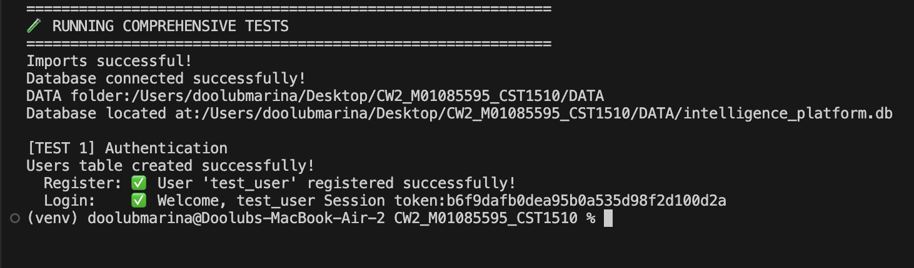

### Users Table
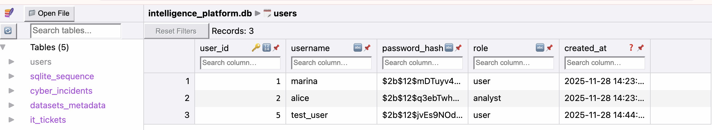

### Main Terminal

### Main Terminal 2
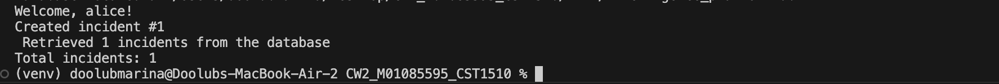

### Users Table Screenshot
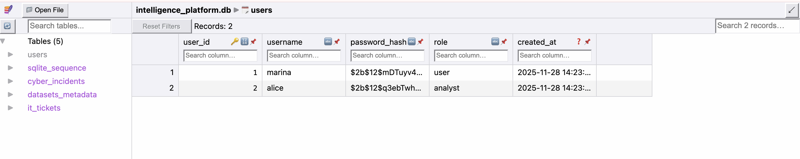

### Users CRUD Operations
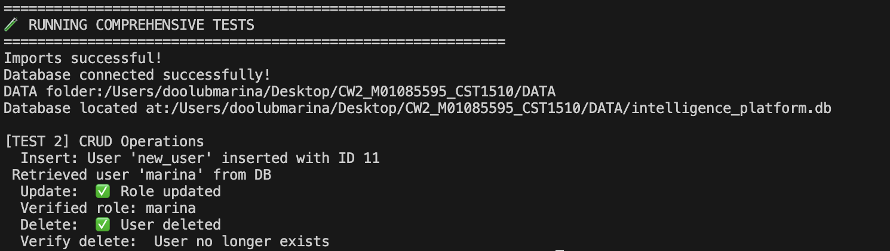

### Setup Terminal
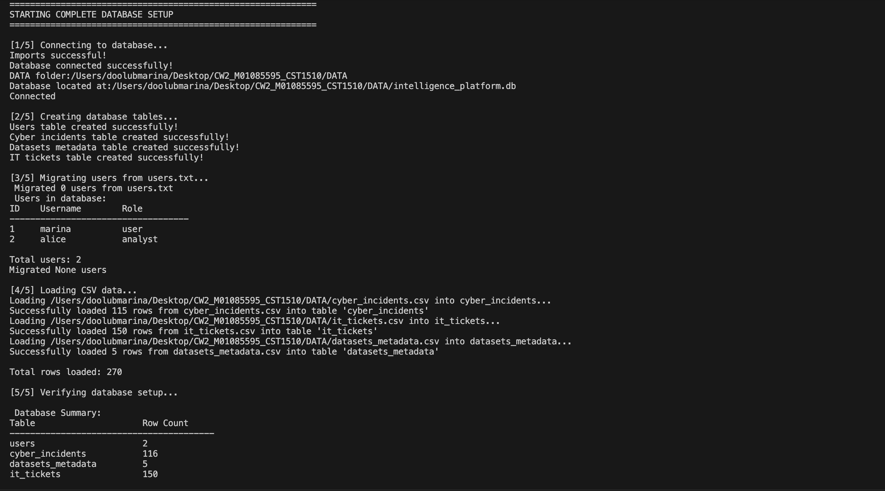

### Main Terminal + DB Table

### IT Tickets Table
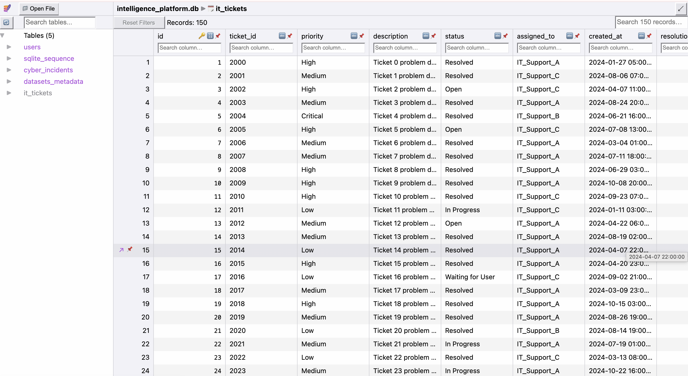

### Datasets Table
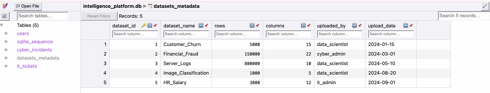

### Cyber Incidents Table
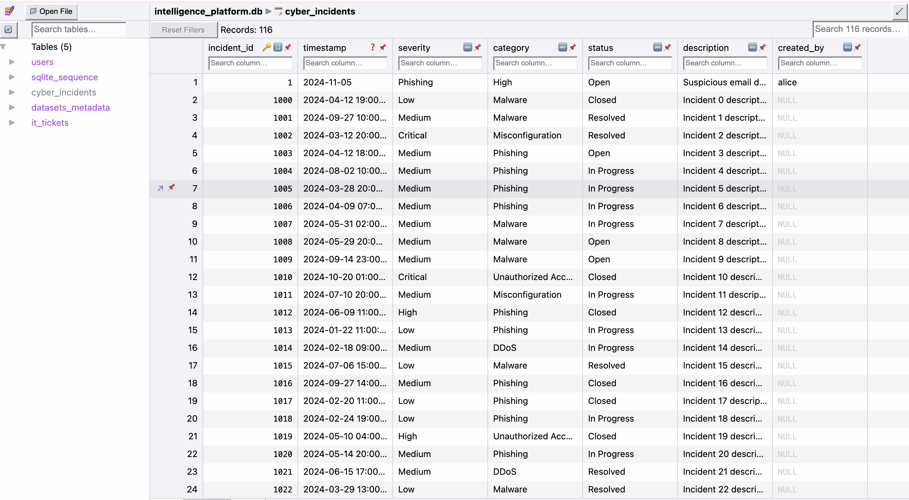

### CRUD Operations Table
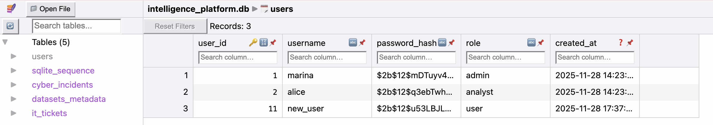

### Analytical Queries Terminal
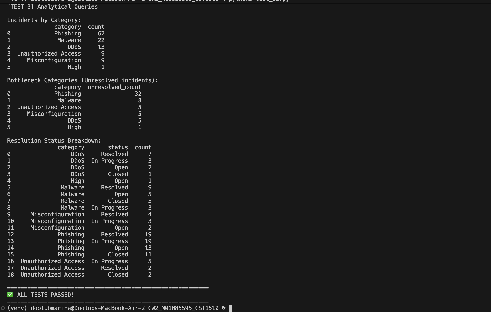
